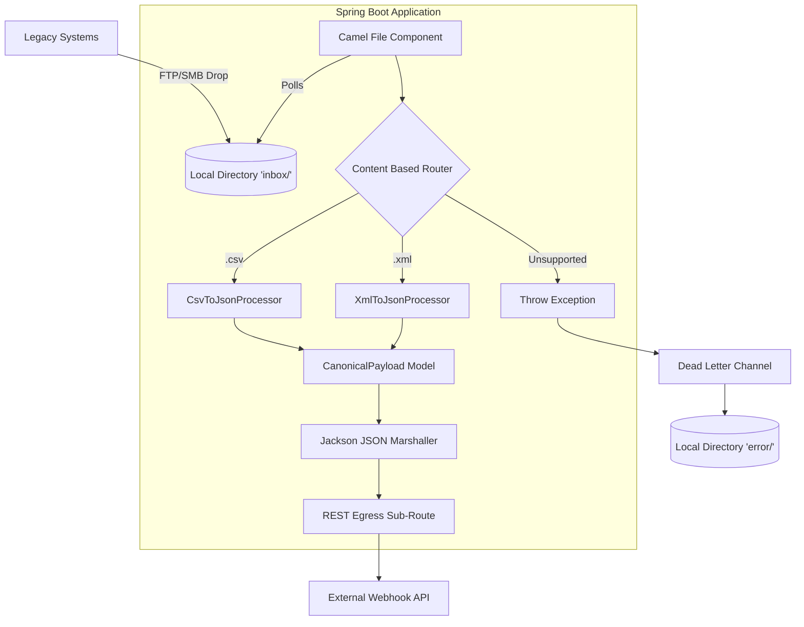

# Architecture

The EDI to JSON Translator Pipeline is built using Java 17, Spring Boot, and Apache Camel. It implements Enterprise Integration Patterns (EIP) to provide idempotent translation of legacy Electronic Data Interchange (EDI) files into canonical JSON payloads.

## Core Components

1.  Ingestion Layer (Apache Camel File Component):
    A polling consumer repeatedly checks the configured input directory for new `*.csv` and `*.xml` files. Once a file is processed, it is either moved to a success folder or a `.camel` folder to ensure it is not processed twice (Idempotent Consumer pattern).

2.  Routing Layer (Content-Based Router EIP):
    Based on the incoming file extension (read from the `CamelFileName` header), the router directs the payload to specific translators. If an unsupported format arrives, an exception is thrown.

3.  Processing Layer:
    -   `CsvToJsonProcessor`: Uses Jackson's CSV extension to map flat CSV columns into the strongly-typed `CanonicalPayload` Java model.
    -   `XmlToJsonProcessor`: Uses Jackson's XML mapping to deserialize hierarchical XML nodes into the `CanonicalPayload` Java model.

4.  Transformation Layer:
    The `CanonicalPayload` object is marshaled into a standard JSON string using Camel's `JacksonDataFormat`.

5.  Egress Layer:
    The resulting JSON is routed to a target HTTP endpoint. For demonstration purposes, this is routed to an internal Mock REST Endpoint (`DummyRestController`) that exposes the translated JSON to a Vanilla JS frontend via a WebSocket or Polling mechanism.

6.  Error Handling (Dead Letter Channel EIP):
    If any routing or transformation step throws an unhandled exception, the Camel context catches it and routes the original file unchanged to an error directory (e.g., `error/`) for later manual review by operational staff.

## Architecture Diagram

## Deployment
The pipeline is designed as a stateless 12-Factor application. Endpoints, ports, and directory mappings are passed as environment variables (e.g., `EDI_REST_ENDPOINT`).
Deployment manifests for Kubernetes (`Deployment` and `Service`) are provided in the `k8s/` directory and enforce a minimum privilege model using non-root UIDs and dropping all capabilities.

- Containerization: A `Dockerfile` is provided using a lightweight JDK 17 alpine image.
- Volumes: Kubernetes PersistentVolumes (PV) or emptyDir mounts are used to project `/app/input` and `/app/error` for file persistence without mutating the read-only root filesystem.
